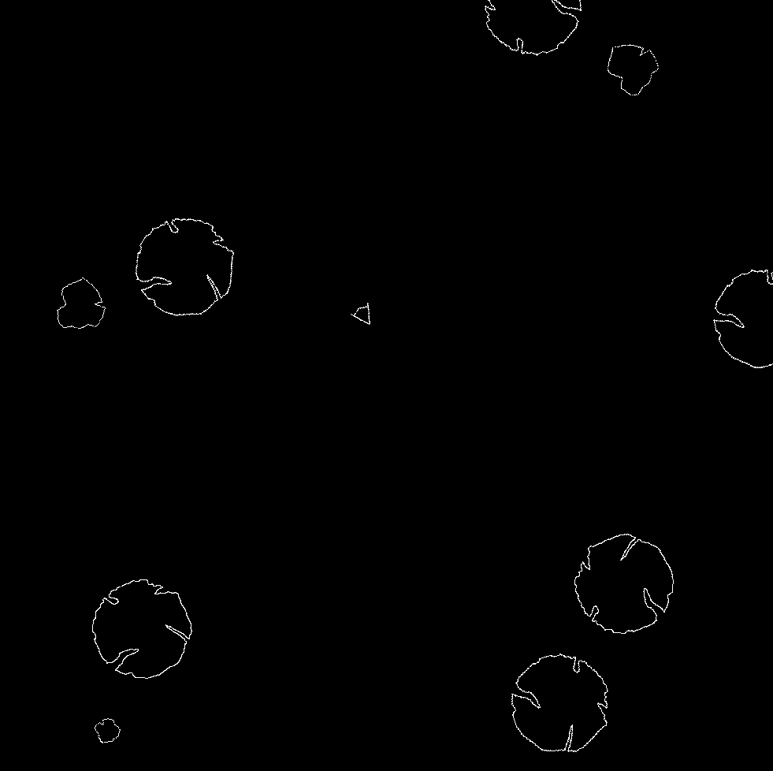

# Kuiper

Kuiper is a small game based on the classic *Asteroid*. This project was made mainly to learn more about C++.

## Build

In a terminal, go to the base folder and run the `build.sh` script. After the compilation, the executable `Kuiper` should appear in this folder.

## Run

To run, the `assets` sub-directory should be in the same directory as the executable.